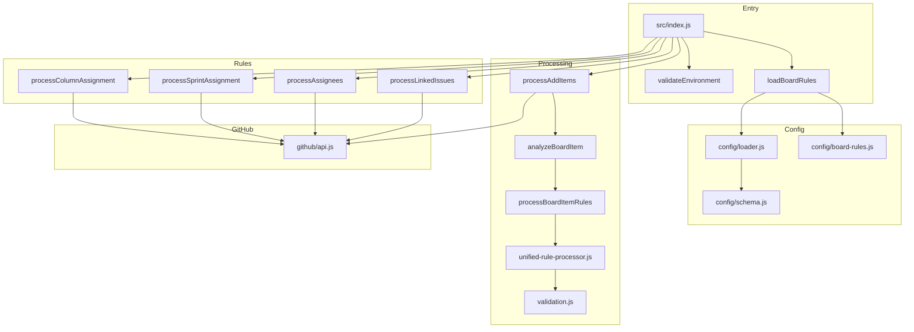

# Repository Assessment: action-gh-project-automator

**Date**: 2026-02-03  
**Assessor**: Kilo Code (Architect Mode)

## Executive Summary

This is a **GitHub Projects v2 automation tool** designed to automatically manage project board items based on configurable rules in `rules.yml`. The tool monitors specified users and repositories, adding items to the board and managing their columns, sprints, and linked issues.

**Overall Assessment**: The architecture is well-designed with good separation of concerns, but there are **critical bugs in the rule condition evaluation** that prevent the system from working correctly. The hardcoded user configuration in `rules.yml` is intentional and appropriate for the current single-user use case.

---

## Architecture Overview



### Key Components

| Component | File | Purpose |
|-----------|------|---------|
| Entry Point | `src/index.js` | Main orchestration, environment validation |
| Config Loader | `src/config/loader.js` | YAML parsing with JSON Schema validation |
| Board Rules | `src/config/board-rules.js` | Merges user_scope and repository_scope rules |
| Rule Processor | `src/rules/processors/unified-rule-processor.js` | Evaluates rules against items |
| Condition Validator | `src/rules/processors/validation.js` | Evaluates trigger conditions |
| GitHub API | `src/github/api.js` | GraphQL/REST API wrappers with caching |

---

## Critical Bugs (Blocking Functionality)

### Bug 1: Multiline YAML Conditions Don't Match Hardcoded Strings

**Severity**: 🔴 CRITICAL  
**Files**: [`rules.yml`](../rules.yml:30-31) and [`src/rules/processors/validation.js`](../src/rules/processors/validation.js:73)

**Problem**: The validation code uses exact string matching for conditions:

```javascript
// validation.js line 73
if (condition.condition === "item.assignees.some(assignee => monitored.users.includes(assignee))") {
```

But `rules.yml` has multiline YAML strings:

```yaml
# rules.yml lines 30-31
condition: "item.assignees.some(assignee =>
  monitored.users.includes(assignee))"
```

When YAML parses this, it becomes: `"item.assignees.some(assignee =>\n  monitored.users.includes(assignee))"`

The newline and indentation cause the string comparison to fail.

**Affected Rules**:
- `assigned_pull_requests` (lines 30-31)
- `assigned_issues` (lines 39-40)
- `skip_if` for `linked_issue_inheritance` (lines 176-177)

**Fix Options**:
1. Normalize condition strings by collapsing whitespace before comparison
2. Reformat `rules.yml` to use single-line conditions
3. Use YAML literal block scalars (`|`) or folded scalars (`>`) consistently

---

### Bug 2: Missing Condition Handlers in Validation

**Severity**: 🔴 CRITICAL  
**File**: [`src/rules/processors/validation.js`](../src/rules/processors/validation.js:39-148)

**Problem**: Several conditions in `rules.yml` have no matching handler in `validateItemCondition()`:

| Condition in rules.yml | Handler Exists? |
|------------------------|-----------------|
| `item.column === 'Next' \|\| item.column === 'Active'` | ✅ Yes (line 94) |
| `item.column === 'Waiting'` | ✅ Yes (line 108) |
| `item.column === 'New' \|\| item.column === 'Parked' \|\| item.column === 'Backlog'` | ❌ **NO** |
| `item.sprint != null` | ❌ **NO** |
| `item.sprint == null` | ❌ **NO** |

**Impact**: Sprint removal rules and some skip conditions will never trigger.

---

## Medium Priority Issues

### Issue 4: Schema Doesn't Validate `existing_items`

**Severity**: 🟡 MEDIUM  
**File**: [`src/config/schema.js`](../src/config/schema.js:56-71)

The `technical.existing_items` section in `rules.yml` is not validated by the schema:

```yaml
existing_items:
  sweep_enabled: false
  min_rate_limit_remaining: 250
```

**Impact**: Invalid configurations won't be caught at load time.

---

### Issue 5: README References Non-Existent Files

**Severity**: 🟡 MEDIUM  
**File**: [`README.md`](../README.md:50-54)

```markdown
- `project-board-sync.js`: The main script
- `fetch-user-assignments.js`: Utility
```

Neither file exists. Should reference `src/index.js`.

---

### Issue 6: Dead Code in add-items.js

**Severity**: 🟢 LOW  
**File**: [`src/rules/add-items.js`](../src/rules/add-items.js:227-301)

Functions `processItemForProject()` and `shouldAddItemToProject()` are defined but never called.

---

### Issue 7: Debug Statements in Production Code

**Severity**: 🟢 LOW  
**File**: [`src/github/api.js`](../src/github/api.js:295-338)

```javascript
log.info(`[DEBUG] Starting addItemToProject...`);
```

These should use `log.debug()` instead of `log.info()`.

---

## What's Working Well

✅ **Configuration Loading**: YAML parsing and JSON Schema validation work correctly  
✅ **GitHub API Integration**: Octokit setup with GraphQL and REST is solid  
✅ **Rate Limiting**: Backoff and rate limit guards are well-implemented  
✅ **Caching**: Project items, field IDs, and status options are cached  
✅ **Logging**: Comprehensive logging with counters and state tracking  
✅ **Architecture**: Clean separation between config, rules, and API layers  

---

## Remediation Plan

### Phase 1: Critical Fixes (Required for Basic Functionality)

1. **Fix multiline condition matching**
   - Option A: Normalize whitespace in validation.js before comparison
   - Option B: Reformat rules.yml to single-line conditions (recommended)

2. **Add missing condition handlers in validation.js**
   - Add handler for `item.column === 'New' || item.column === 'Parked' || item.column === 'Backlog'`
   - Add handlers for `item.sprint != null` and `item.sprint == null`

### Phase 2: Quality Improvements

4. **Update schema.js** to validate `existing_items`
5. **Update README.md** with correct file references
6. **Remove dead code** from add-items.js
7. **Fix debug logging** to use `log.debug()` instead of `log.info()`

### Phase 3: Documentation

8. **Create missing specs** for implemented features
9. **Add GitHub Actions workflow** for CI/CD

---

## Testing Recommendations

After fixes, verify with:

```bash
# Run existing tests
npm test

# Manual verification
DEBUG=1 node src/index.js
```

Key scenarios to test:
1. PR authored by monitored user → added to board
2. Issue assigned to monitored user → added to board
3. Item in monitored repo → added to board
4. New PR → column set to Active
5. Item in Done column → sprint assigned
6. Item in New/Parked/Backlog → sprint removed

---

## Conclusion

The codebase has a solid foundation but cannot function due to critical bugs in:
1. Multiline YAML string matching in condition validation
2. Missing condition handlers for sprint rules

Once these are fixed, the system should work as designed. The hardcoded user configuration is appropriate for the current use case and can be easily extended for multiple users later.
